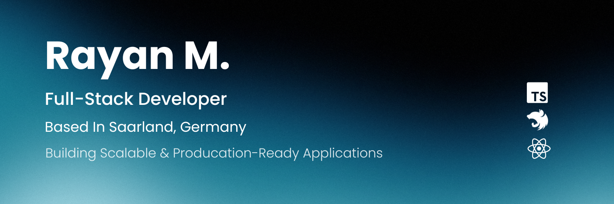

  

<h1 align="center">Rayan Mustafa</h1>

  

  Building scalable, production-grade web applications with modern technologies.

---

## 🧑‍💼 About Me

I'm Rayan Mustafa, a Germany-based Full Stack Developer specializing in scalable APIs, backend systems, dashboards, and modern e-commerce solutions.

💡 I focus on building clean architecture, performance-driven systems, and production-ready applications.

🚀 Currently working as a Freelancer — Open to remote collaborations and long-term partnerships.

📍 Saarland, Germany

---

## 🏗 Core Competencies

- Scalable Backend Architecture (NestJS)
- REST API Design & Implementation
- Authentication & Authorization (JWT, RBAC)
- Database Modeling & Optimization
- Frontend Application Architecture (React / Next.js)
- Dockerized Deployment Workflows
- Clean Code & Modular Design Principles

---

## ⚙️ Technical Stack

<table>
<tr>
<td width="50%">

### Frontend

  

  

</td>
<td width="50%">

### Backend

  

</td>
</tr>

<tr>
<td width="50%">

### Database & Caching

  

</td>
<td width="50%">

### DevOps & Infrastructure

  

</td>
</tr>

<tr>
<td width="50%">

### Testing & API Tools

  

</td>
<td width="50%">

### Version Control & IDE

  

</td>
</tr>
</table>

---

## 📊 GitHub Metrics

  
  

  

## 🌐 Contact

  
    

---

  Engineering scalable systems from frontend to backend.

